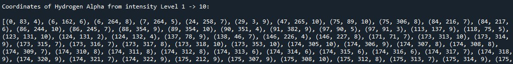
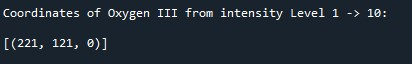
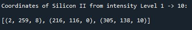
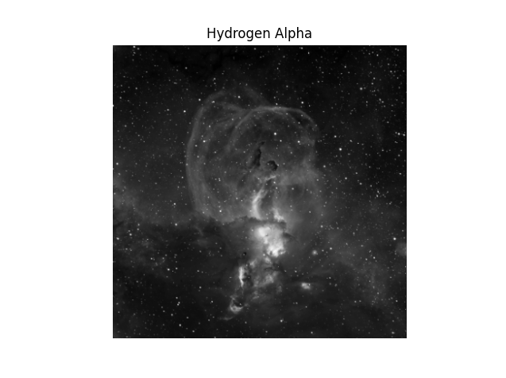
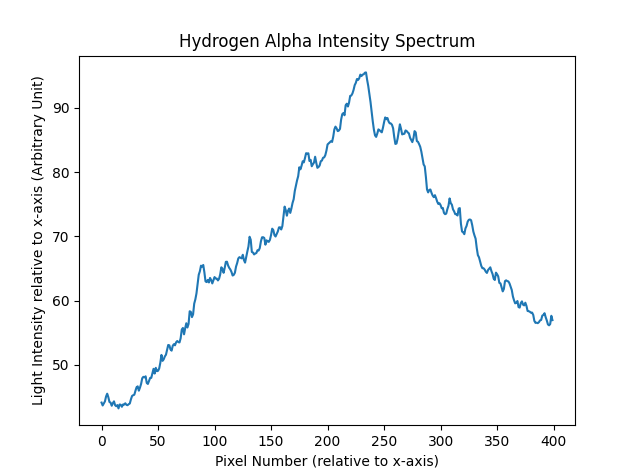
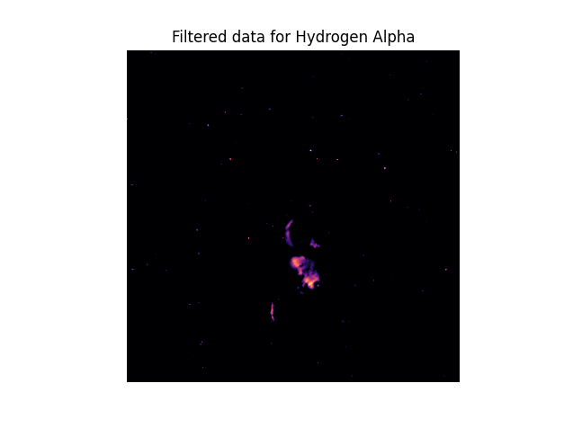
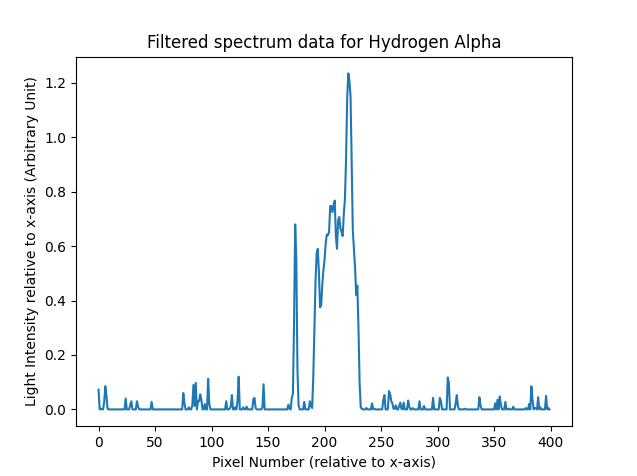

# Nebula Intensity

Analysing areas of high and low intensity of Statue of Liberty Nebulae based on user specifications.

Data sourced from [this site](https://www.mattdieterich.com/nebuladata "www.mattdieterich.com")  where it was captured from ObsTech in Chile.

## FitExtraction.py file (by Amani5576)
This file opens and extracts the HDU data from the fit files and puts them into an array; HDUs.
Each fit File consists of a Primary and an Image HDU. These are two sub-lists within each element of HDUs

`HDUs[0]` ---> `[PrimaryHDU, ImageHDU]` from Hydrogen Alpha Fit file
 
`HDUs[1]` ---> `[PrimaryHDU, ImageHDU]` from Oxygen III Fit file
 
`HDUs[2]` ---> `[PrimaryHDU, ImageHDU]` from Silicon II Fit file
     
Hence accessing the `ImageHDU` of in row element `x` of `HDUs` array: 
            
    HDUs[x][1]

Running the file allows you to get necessary information from the header of the Primary such as *Number of data Axes for ImageHDU*, *Approximate right ascension in hours*, *Name of Object*, etc. The file can be run by running python ./FitExtraction.py on any terminal emulator on a computer with Python 3 installed.

## DataAnalysis.py file (by Amani5576)
This file:
* Closes the Fit files that were opened in the FitsExtraction.py

* Takes the Image HDU data of fit files and puts them in numpy arrays

* Computes Statistical data with regards to pixel numbered values
    - Median pixel value
    - Mode(s) of pixel value(s)
    - Standard Deviation of pixel values.
    
* Allows user input in assesment of relative intenisty based on a specific ImageHDU

    -Lets user decide on scaling Factor. For Example:

         You've chosen Scaling factor to be 6 (6 levels of varying intensity):
         
         If max = 80 and min = 20 then range is (80 - 20) = 60
         By dividing the range by the Scale we get -> 60/6 = 10.
         Hence, from Level 1 (highest intensity) to Level 2
         (Second highest intensity) is a difference of 10.
     
    -Lets user decide on the number of level intensities desirable (from highest intesity as the first level)
    For Example:

        Level 1 -> highest intensity level (Thus, type in the integer "1")
        Level 2 -> 2nd highest intensity up until highest intenisty (Thus, type in the integer "2")
        Level 3 -> 3rd highest intensity up until highest intenisty (Thus, type in the integer "3")
        Level 4 -> 4th highest.......etc   
            
    **NOTE**: There automatically exists an initial **level 0**. This intenisty level is only for one value in particular which has the highest intensity value within the *entire matrix*.
             
    *The above essestially decreases processing time if not all intensity levels are desired.*

* Allows user to choose three data ouputs: (which are limited by users chosen Scaling factor)

    -Get pixels that belong to all levels of intensity up until the lowest intensity; then user inputs:
    
    `Yes` *(in order to see all levels)* 
        
    -Get pixels that belong to a particular level of intenisty; then user inputs:
    
    `x` *(`x` is an integer Level number)*
        
    -Let pixels that belong to particular levels of intenisty; then user inputs:
    
    `x,y,z,...` *(multiple integer level numbers of any random chosen level split by commas)*
        
The pixels will be given in terms of a tuple:

    (<x-coord> , <y-coord> , <Intensity_level>)

See image below with an example of chosen user input:

1. Scaling Factor = `40`
2. Level Limit = `10` 
3. Last user input = `yes` 

    
Tuples are used in plotting of filtered data in spectra.py @rofhima13.

For the Hydrogen Alpha Filtered data:


    
For the Oxygen III Filtered data:


    
For the Silicon II Filtered data:



The file can be run by running python ./DataAnalysis.py on any terminal emulator on a computer with Python 3 installed.

## showSection.py file (by Amani5576)

This file shows the initial ImageHDU matrix of each Fit file before any filtration occurs. This is due to the fact that each numbered value in the matrices is a quanitity of the number of photons captured by the Telescope. Each element is a pixel containing a specified number of photons. Very useful for comparison between plots that are made with *spectra.py* file @rofhima13.

**NOTE**: This can only be called after running through the DataAnalysis.py and its case sensitive.


* For Hydrogen Alpha matrix:

        show(fitFiles[0])  or   show("HA.fits")
    
* For Oxygen III matrix:

        show(fitFiles[1])  or   show("OIII.fits")
    
* For Silicon 2 matrix:

        show(fitFiles[2])  or   show("SII.fits")


## Results.py file (by Amani5576)

This file extracts the original image matrices, and filtered image matrices from the DataAnalysis module @Amani5576 constructed from the FIT files, and constructs a horizontal spectrum relative to the x-axis of the image, or from a viewer's point of view, and displays all of the resultant plots using all of the data.

For the purposes of demonstration, only information pertaining to the Hydrogen Alpha spectra will be shown below.

This is what the original Hydrogen Alpha image looks like:



The full spectrum for the Hydrogen Alpha Nebula looks something like this:



When an image is constructed using the filtered data for the Hydrogen Alpha Nebula, it looks something like this (a different color filter is used):



When the below spectrum for the filtered data is compared with the filtered image, it becomes easier to discern where the brightest spots in the image are located.



Taking note of all the above information, looking at the filtered spectrum it's evident that the brightest spots of the Hydrogen Alpha Nebula are located by the horizontal center of the image, and the filtered image reflects that information.

The file can be run by running ```python ./spectra.py``` on any terminal emulator on a computer with Python 3 installed.

Make sure to run ```pip install -r requirements.txt``` before you run!

## tester.py file (by Amani5576)

This file loops through all intensity levels and outputs an image of the filtered data with respect to that level.

NOTE: This should be run after Results.py

<video width="320" height="240" controls>
  <source src="NGC 3576 Temp expansion HA.mp4" type="video/mp4">
Browser cannot support video.
</video>