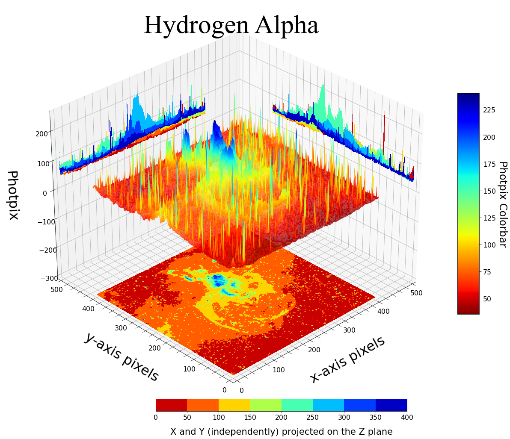
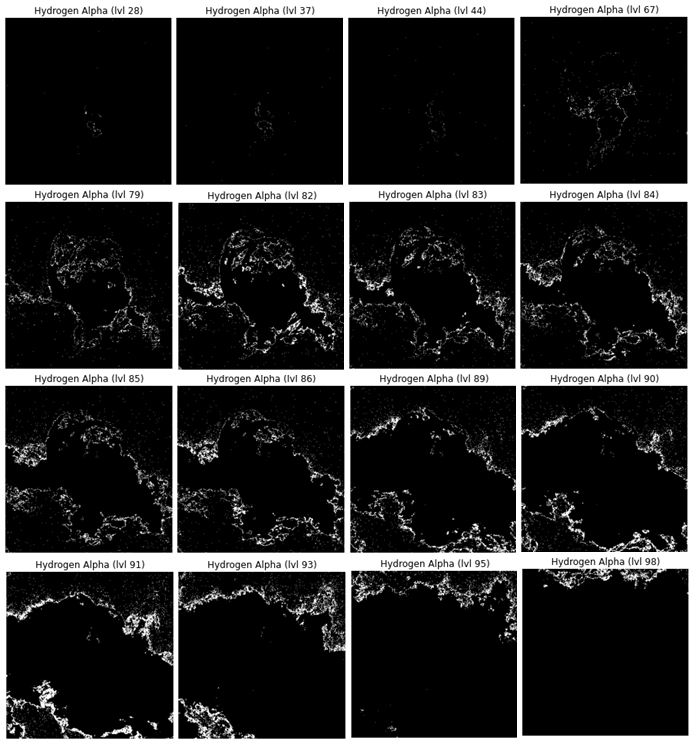
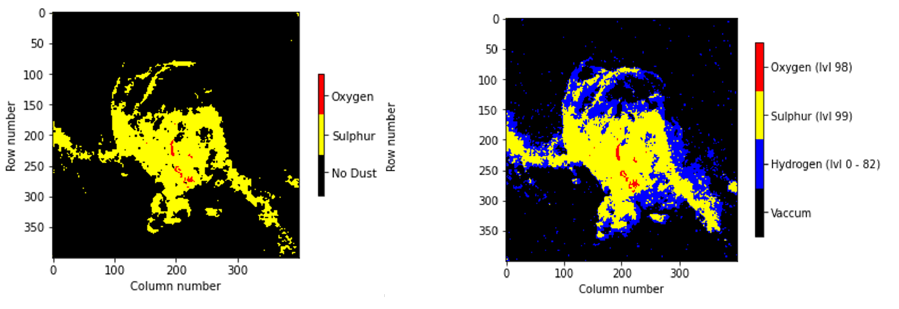

# Nebula Temperature Readings

Analyzing areas of high and low intensity of Statue of Liberty Nebulae based on user specifications.

Data sourced from [this site](https://www.mattdieterich.com/nebuladata "www.mattdieterich.com")  where it was captured from ObsTech in Chile.

## FitExtraction.py file
This file opens and extracts the HDU data from the fit files and puts them into an array; HDUs.
Each fit File consists of a Primary and an Image HDU. These are two sub-lists within each element of HDUs

`HDUs[0]` ---> `[PrimaryHDU, ImageHDU]` from Hydrogen Alpha Fit file
 
`HDUs[1]` ---> `[PrimaryHDU, ImageHDU]` from Oxygen III Fit file
 
`HDUs[2]` ---> `[PrimaryHDU, ImageHDU]` from Sulphur II Fit file 
     
Hence accessing the `ImageHDU` of in row element `x` of `HDUs` array: 
            
    HDUs[x][1]

Running the file allows you to go through a series of questions to give the necessary information from the header of the Primary such as *Number of data Axes for ImageHDU*, *Approximate right ascension in hours*, *Name of Object*, etc. The file can be run by running ```python ./FitExtraction.py``` on any terminal emulator on a computer with Python 3 installed.

## DataAnalysis.py file
This file:
* Closes Fit files that were opened in the FitsExtraction.py file.

* Converts Image HDU data into numpy arrays

* Shows 3D plots of Raw Data: (Examples below are with respect to 100 constructed intensity levels)



https://github.com/Amani5576/NGC-3576-Temperature-Readings/assets/110545729/d4091abd-d46c-4179-a9ab-ee6cf46722c8

https://github.com/Amani5576/NGC-3576-Temperature-Readings/assets/110545729/5f35b888-6112-402a-8062-c3fd6d048707

* Shows unfiltered matrices of fit file images

* Computes Statistical data with regards to pixel-numbered values; (see ```def print_stat_dat(...)```) E.g:
    - Median pixel value
    - Mode(s) of pixel value(s)
    - Standard Deviation of pixel values.

* Copy MESH of Raw Data into CSV files
    
* Allows user input in the assessment of relative intensity levels desired based on each specific ImageHDU

    - User decides on scaling Factor (see ```def get_scaling_Factor()```) . For Example:

    You've chosen Scaling factor to be 6 (6 levels of varying intensity):
         
    If max = 80 and min = 20 then range is (80 - 20) = 60
    By dividing the range by the Scale we get -> 60/6 = 10.
    Hence, from Level 1 (highest intensity) to Level 2
    (Second highest intensity) is a difference of 10.
     
    - User decides on the number of level intensities desirable (from highest intensity as the first level)
     For Example:

        Level 1 -> highest intensity level (Thus, type in the integer "1")
        Level 2 -> 2nd highest intensity up until highest intensity (Thus, type in the integer "2")
        Level 3 -> 3rd highest intensity up until highest intensity (Thus, type in the integer "3")
          |    ... nth highest intensity up until highest intensity 
	Level N <= maxLevel -> Lowest intensity level   
            
    **NOTE**: There automatically exists an initial **level 0**.

  This intensity level is only for one value in particular which has the highest intensity value within the *entire matrix*.
             
    *The above step essentially decreases processing time if not all intensity levels are desired. See nested for loops in ```def fundamental_filt(...)```)

Gives Results.py filtered data of each pixel in the form:

	(<x-coord> , <y-coord> , <Intensity_level>)

The file can be run by running ```python ./DataAnalysis.py``` on any terminal emulator on a computer with Python 3 installed.

## showSection.py file (by Amani5576)

Used further in Results.py code if user would like to see the Nebula before filtering out the data.
This file shows the initial ImageHDU matrix of each Fit file before any filtration occurs. 
This is due to the fact that each numbered value in the matrices is a quantity of the number of photons captured by the Telescope. Each element is a pixel containing a specified number of photons.

Choice given for the user is only to view one fit file out of the 3 image fit files.
Hence, after running Results, one can still refer back to showSection to reveal the other two.

* For Hydrogen Alpha matrix:

        show(fitFiles[0])  or   show("HA.fits")
    
* For Oxygen III matrix:

        show(fitFiles[1])  or   show("OIII.fits")
    
* For Sulphur 2 matrix:

        show(fitFiles[2])  or   show("SII.fits")

## Results.py file (by Amani5576)
This file:

* Copies filtered data (in form of tuples) to CSV files.

(See ```def csv_export_query()```)

* Prints pixel data outputs of tuples with respect to the user's previous choices 

See the following:
```def print_tuple_data(...)```
```def specify_levels(...)```
```def get_user_custom_levels()```

Tuples are used in plotting filtered data by functions such as ```plot_combined()```.

Below is an example of the following chosen user inputs:

1. Scaling Factor = `40`
2. Level Limit = `10` 
3. Last user input = `yes` 

For the Hydrogen Alpha Filtered data:


    
For the Oxygen III Filtered data:


    
For the Sulphur II Filtered data:


* Gives Nebulae images prior to the filtration that occurred in DataAnalysis

* Gives options of data to display: (See ```def viewing()```)
    - Tuples
    - Graphs and Pie Charts (Come in unison)
    - Tables
    - Images
    - Combinations of the above options (user input must be comma separated)
    - 3D Graphing
    - Pixel Frame (Printing filtered images of each intensity level)

The "Pixel Frame" choice allows the user to look at all different layers of a particular matrix. Each layer represents a matrix with the same size as the original image but with regards to only one intensity of Photons. (Which can correlate to temperature readings)
Below is an image of the different layers of the Hydrogen Alpha that have significantly noticeable differences.


##3d_video
Below is a video of the combination of the HA images with regard to the splitting of 100 levels.


https://github.com/Amani5576/NGC-3576-Temperature-Readings/assets/110545729/a3ccf4d7-3be7-4862-9d25-7fe68a4331f9

The 3D graphing allows more than just two layers to be compared unlike the video above. Based on user specifications, more than one level of one dataset can be viewed in combination with another dataset range of levels (e.g. HA lvl 1->5 with OIII lvl 78->90) in a 3D format. Graphs contain contours that feature the _kernel density estimation_ of the **average** density of the scatter plot. The contours are featured to reflect the average density of the scatter plots with regard to projections onto the x, y, and z planes.

Below are [outputs] of the following where Scaling Factor = Level Limit = `100`:


https://github.com/Amani5576/NGC-3576-Temperature-Readings/assets/110545729/10f4c9fc-ece3-44b0-99c7-64af9f12abda


**NOTE**: Photpix = Photpix Level (made by user specifications of Scaling Factor).

The file can be run by running ```python ./Results.py``` on any terminal emulator on a computer with Python 3 installed.
Make sure to run ```pip install -r requirements.txt``` before you run!

Manual manipulation of code is needed for the superimposition of the dust data onto the stars data like so:


